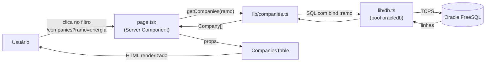
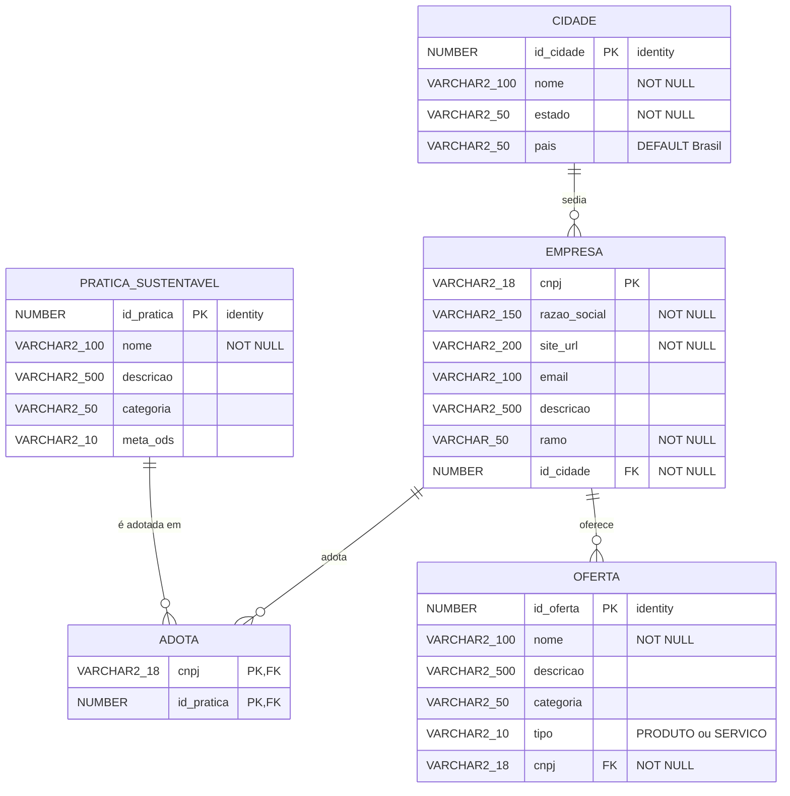

# Sustaintability Tracker — Documentação

## 1. Overview

**Sustaintability Tracker** é um site que reúne em um só lugar um compilado de empresas que desenvolvem seus produtos e serviços de maneira sustentável. O projeto apoia o **ODS 12 — Consumo e Produção Responsáveis**, da ONU, dando visibilidade a empresas com boas práticas ambientais e facilitando a busca por elas.

O projeto foi idealizado por estudantes de Ciência da Computação da Universidade Federal Fluminense.

Link para o site: https://sustaintability-tracker.vercel.app/

### 1.1 Objetivos

- Divulgar empresas com práticas sustentáveis.
- Permitir a busca de empresas por ramo de atuação.
- Contribuir com a conscientização sobre o ODS 12.
- Manter uma interface simples, leve e acessível.

### 1.2 Páginas

| Página         | Rota                      | Descrição                                                       |
| -------------- | ------------------------- | --------------------------------------------------------------- |
| Home           | `/`                       | Apresentação do projeto, com botões de acesso às demais páginas |
| Sobre nós      | `/about`                  | Propósito do projeto, relação com o ODS 12 e autores            |
| Empresas       | `/companies`              | Tabela de empresas lidas do banco, com filtro por ramo          |
| Não encontrada | qualquer rota inexistente | Página 404 personalizada (`not-found.tsx`)                      |

---

## 2. Stack

- NextJS
- Bun
- TailwindCSS
- OracleDB(FreeSQL)

### 2.1 Estrutura de pastas

```
meu-projeto/
├── public/                     # Arquivos estáticos
├── src/
│   ├── app/
│   │   ├── layout.tsx          # Fonte, navbar e estrutura global
│   │   ├── globals.css         # Tailwind, cor jade e gradiente de fundo
│   │   ├── not-found.tsx       # Página 404
│   │   ├── page.tsx            # Home
│   │   ├── about/
│   │   │   └── page.tsx        # Sobre nós
│   │   └── companies/
│   │       └── page.tsx        # Busca de empresas
│   ├── components/
│   │   ├── Navbar.tsx          # Navbar flutuante (Client Component)
│   │   ├── MainCard.tsx        # Card branco central reutilizável
│   │   ├── RamoFilter.tsx      # Botões de filtro por ramo
│   │   └── CompaniesTable.tsx  # Tabela de empresas
│   └── lib/
│       ├── data-source.ts               # Pool de conexões com o Oracle
│       ├── find-companies.ts        # Consulta de
│       ├── entities.ts        # Definição do Schema no typeORM
│       └── ramos.ts            # Lista fixa de ramos do filtro
├── .env.local                  # Credenciais do banco (não versionar)
├── next.config.ts
└── package.json
```

### 2.2 Fluxo de dados



### 2.3 Variáveis de ambiente

Definidas em `.env.local` (esse arquivo **não** deve ser versionado):

| Variável            | Descrição                                       | Exemplo                    |
| ------------------- | ----------------------------------------------- | -------------------------- |
| `DB_USER`           | Usuário do schema                               | `SQL_XXXXXXXX`             |
| `DB_PASSWORD`       | Senha (use aspas se tiver caracteres especiais) | `"minha*senha"`            |
| `DB_CONNECT_STRING` | String de conexão do banco                      | `tcps://host:2484/servico` |

---

## 3. Modelagem dos dados


### 3.1 Diagrama entidade-relacionamento


### 3.2 Modelo Relacional

```
CIDADE(id_cidade, nome, estado, pais)

EMPRESA(cnpj, razao_social, site_url, email, descricao, id_cidade)
    id_cidade referencia CIDADE

PRATICA_SUSTENTAVEL(id_pratica, nome, descricao, categoria, meta_ods)

ADOTA(cnpj, id_pratica)
    cnpj referencia EMPRESA
    id_pratica referencia PRATICA_SUSTENTAVEL

OFERTA(id_oferta, nome, descricao, categoria, tipo, cnpj)
    cnpj referencia EMPRESA

```

### 3.3 Script de criação (DDL)

```sql
CREATE TABLE cidade (
  id_cidade NUMBER GENERATED ALWAYS AS IDENTITY PRIMARY KEY,
  nome      VARCHAR2(100) NOT NULL,
  estado    VARCHAR2(50)  NOT NULL,
  pais      VARCHAR2(50)  DEFAULT 'Brasil' NOT NULL
);

CREATE TABLE empresa (
  cnpj         VARCHAR2(18)  PRIMARY KEY,
  razao_social VARCHAR2(150) NOT NULL,
  site_url     VARCHAR2(200) NOT NULL,
  email        VARCHAR2(100),
  descricao    VARCHAR2(500),
  id_cidade    NUMBER NOT NULL,
  CONSTRAINT fk_empresa_cidade FOREIGN KEY (id_cidade)
    REFERENCES cidade (id_cidade)
);

CREATE TABLE pratica_sustentavel (
  id_pratica NUMBER GENERATED ALWAYS AS IDENTITY PRIMARY KEY,
  nome       VARCHAR2(100) NOT NULL,
  descricao  VARCHAR2(500),
  categoria  VARCHAR2(50),
  meta_ods   VARCHAR2(10)
);

CREATE TABLE adota (
  cnpj       VARCHAR2(18) NOT NULL,
  id_pratica NUMBER       NOT NULL,
  CONSTRAINT pk_adota PRIMARY KEY (cnpj, id_pratica),
  CONSTRAINT fk_adota_empresa FOREIGN KEY (cnpj)
    REFERENCES empresa (cnpj),
  CONSTRAINT fk_adota_pratica FOREIGN KEY (id_pratica)
    REFERENCES pratica_sustentavel (id_pratica)
);

CREATE TABLE oferta (
  id_oferta NUMBER GENERATED ALWAYS AS IDENTITY PRIMARY KEY,
  nome      VARCHAR2(100) NOT NULL,
  descricao VARCHAR2(500),
  categoria VARCHAR2(50),
  tipo      VARCHAR2(10) NOT NULL,
  cnpj      VARCHAR2(18) NOT NULL,
  CONSTRAINT ck_oferta_tipo CHECK (tipo IN ('PRODUTO', 'SERVICO')),
  CONSTRAINT fk_oferta_empresa FOREIGN KEY (cnpj)
    REFERENCES empresa (cnpj)
);
```
